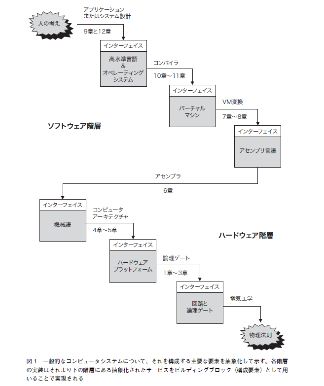

NAND
    単純な電子ゲート

論理回路、加算器、ALU、CPU

## アプリケーションの構造
下記のように、アプリケーションはレイヤー分けができる。

流れは下記。

### コンパイル言語とインタプリタ言語
開発者が手動でコンパイルする必要があるかどうか。
コーディング → コンパイル → バイナリ という流れは、両者同じ。

## ハードウェア
ハードウェアアーキテクチャの実装には、回路集合が用いられる。
レジスタ、メモリ、ALU など

これらのハードウェアデバイスはどれもがすべて、集積されパッケージされた基本論理ゲート（elementary
logic gate）から構成される。
そしてさらに、これらのゲートはNAND やNOR など
のプリミティブなゲートから構築することができる。
もちろん、これらのゲートはすべてスイッチング素子（switching device）から成り立っていて、スイッチング素子は一般的にトランジスタによって作られる。

## ブール論理
### Nand
