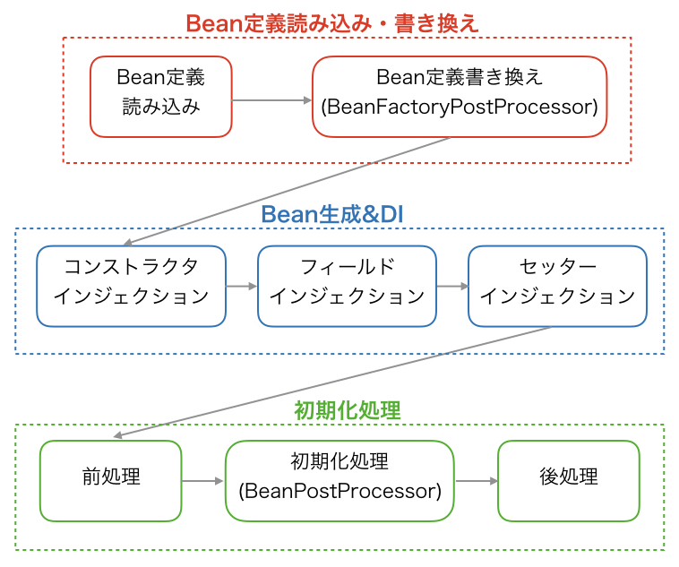

- [各種ドキュメント、URL](#各種ドキュメントurl)
- [Springの構造](#springの構造)
- [Springのコンテナ](#springのコンテナ)
- [Spring framework の動き方](#spring-framework-の動き方)
- [factory method pattern](#factory-method-pattern)
- [フレームワークの構造](#フレームワークの構造)
- [リソースコントローラー](#リソースコントローラー)
- [POJO（Plain Old Java Object）](#pojoplain-old-java-object)
- [Spring devtools](#spring-devtools)
- [MVC](#mvc)
- [Spring MVC](#spring-mvc)
- [ドメイン駆動設計 Domain Driven Design](#ドメイン駆動設計-domain-driven-design)
- [3層アーキテクチャ](#3層アーキテクチャ)
- [クラス依存 → インターフェイス依存](#クラス依存--インターフェイス依存)
- [Bean](#bean)
	- [Bean定義の方法](#bean定義の方法)
		- [Java ベースConfiguration](#java-ベースconfiguration)
		- [アノテーションベースConfiguration](#アノテーションベースconfiguration)
		- [XML ベースConfiguration](#xml-ベースconfiguration)
- [Spring DI (dependency injection): Springのコア機能](#spring-di-dependency-injection-springのコア機能)
	- [IoC（Inversion of Control）](#iocinversion-of-control)
	- [DIの役割](#diの役割)
		- [1.メモリ使用の効率化](#1メモリ使用の効率化)
			- [DIにおけるシングルトンパターン](#diにおけるシングルトンパターン)
		- [2.クラス間の結合度を小さくする。（開発効率、保守性を高める。）](#2クラス間の結合度を小さくする開発効率保守性を高める)
	- [DIの仕組み](#diの仕組み)
		- [1. 対象のコンポーネント（クラス）をBeanとして登録する。](#1-対象のコンポーネントクラスをbeanとして登録する)
		- [2. 注入（Injection）の受け口を設定する。](#2-注入injectionの受け口を設定する)
	- [DIを使用しないコンポーネント](#diを使用しないコンポーネント)
- [Spring AOP (Aspect Oriented Programming): Springコア機能](#spring-aop-aspect-oriented-programming-springコア機能)
	- [使用されている機能の例](#使用されている機能の例)
- [nullセーフ](#nullセーフ)
- [SpringのApplicationクラス](#springのapplicationクラス)
- [画面遷移の際に値を保持する](#画面遷移の際に値を保持する)
- [メソッドを定期的に実行する](#メソッドを定期的に実行する)
- [Maven でプロジェクトを構築する](#maven-でプロジェクトを構築する)
- [DBを扱う](#dbを扱う)
- [DBを操作する](#dbを操作する)
- [認証](#認証)
- [バリデーション](#バリデーション)
- [各種ファイル](#各種ファイル)
- [アノテーション](#アノテーション)


----------


## 各種ドキュメント、URL
(https://gist.github.com/kenta-polyglot/bc0657525f37cd50c9f9399a4f86b04a)
詳しくて役立つ : https://qiita.com/opengl-8080/items/eb3bf3b5301bae398cc2

クラス構造
	参考リポジトリ
		大規模システム
			https://github.com/macrozheng/mall
		spring bootの各機能をまとめたリポジトリ
			https://github.com/xkcoding/spring-boot-demo
		その他
			https://github.com/elunez/eladmin

			https://github.com/linlinjava/litemall/tree/master/litemall-vue
			https://github.com/YunaiV/ruoyi-vue-pro
			https://github.com/yudaocode/SpringBoot-Labs
			https://github.com/shuzheng/zheng
			https://github.com/doocs/source-code-hunter
			https://github.com/seaswalker/spring-analysis

公式ドキュメント: https://spring.pleiades.io/spring-framework/reference/

仕様の解説は下記も参考になる。
GeeksforGeeks: https://www.geeksforgeeks.org/spring-ioc-container/

## Springの構造
	実態はコンテナでありBeanのfactoryとして動作する

## Springのコンテナ
	BeanFactoryコンテナ
	ApplicationContextコンテナ

	BeanFactoryインターフェースは、Beanのインスタンス化、構成、ライフサイクルの管理を行うための高度な構成メカニズムを提供する最もシンプルなコンテナであり、
	ApplicationContextの親インターフェースである基本的なIoCコンテナを表します。
	IoC Container ･･･Spring Frameworkの中核。
		オブジェクトを作成し、依存関係を設定し、組み立て、そのライフサイクル全体を管理します。
		コンテナは、依存性注入（DI）を使用して、アプリケーションを構成するコンポーネントを管理します。
		コンテナは、設定ファイル（XML）、Javaコード、Javaアノテーション、Java POJOクラスから、オブジェクトに関する情報を取得します。
		これらのオブジェクトはBeanと呼ばれます。Javaオブジェクトとそのライフサイクルの制御は開発者が行うものではないので、Inversion Of Controlという名前になっています。
		https://www.geeksforgeeks.org/spring-ioc-container/

	Application context ･･･
		アプリケーションの設定を行うためのセントラルインターフェイス。
		BeanFactoryを間接的に継承する

## Spring framework の動き方
	コンポーネントスキャン
		「起動時」に対象プロジェクトのパッケージをすべてスキャンします
		@Componentのついたクラスを見つけたらインスタンス化しDIコンテナに保存する
		@Repository,@Service...は@Componentをつけたことと同じになりインスタンス化される
	インスタンス生成アノテーションが付与されているクラスを抽出し(図 3.25)、抽出したクラスをインスタンス化します

## factory method pattern
	オブジェクトを作成するために、Java インターフェースまたは抽象クラスであるインターフェイスを使う
	直接newする(コンストラクタを呼び出す)のではなく、メソッドを呼び出すことで密結合をへらす

	例)
	<<interface>> Vehiclefactory
		+ createVehicle(): Vehicle
	AirplaneFactory Aireplaneへ依存 実現
		+ createVehicle(): Aireplane
	BoatFactory Boatへ依存 実現
		+ createVehicle(): Boat
	<<interface>> Vehicle
		+ drive(): void
	Aireplane 実現
		+ drive(): void
	Boat 実現
		+ drive(): void

## フレームワークの構造
	モジュールに分かれており、構成モデルと依存性注入メカニズムを含むコアコンテナーのモジュールが中核となる

## リソースコントローラー
	HTTP リクエストはコントローラーによって処理されます
	@RestController
		RESTful Webサービスの作成を簡素化するために、導入されました。
		これは、 @Controllerと@ResponseBodyを組み合わせた便利なアノテーションであり、コントローラークラスのすべてのリクエスト処理メソッドに@ResponseBodyアノテーションを付ける必要がありません。

## POJO（Plain Old Java Object）
	通常のJavaオブジェクトであり、Java言語仕様によって強制されるもの以外の特別な制限に拘束されず、クラスパスを必要としません。
	POJOは、プログラムの可読性と再利用性を高めるために使用されます。
	POJOは、記述と理解が容易なため、最も受け入れられています。

## Spring devtools
	Automatic Restart ･･･Spring boot を自動で再起動してくれる。
	Hot swapping ･･･自動でhtmlファイルの変更を反映
		application.propertiesに追記

## MVC
	Controller
		@Controllerを使い登録する
		クライアントからの入力を View から受け取り、それをもとに Model に指示を伝えます。
		その後、Model から受け取った値を View に伝え、見た目に反映させます。

## Spring MVC
	構造 : https://terasolunaorg.github.io/guideline/public_review/Overview/SpringMVCOverview.html#:~:text=Overview%20of%20Spring%20MVC%20Processing%20Sequence%C2%B6
	DispatcherServlet ･･･すべてのリクエストを受信するフロントコントローラです

	Modelインターフェイス
		処理したデータをViewに受け渡す役割を持っています
		「Spring MVC」により管理され、手動または自動でオブジェクトを格納し管理する機能を提供します
		「Model」を利用したい場合、リクエストハンドラメソッドの引数に「Model 型」を渡します。すると「Spring MVC」が自動的に「Model 型のインスタンス」を設定してくれます

		Viewへ情報を受け渡す
			Modelインターフェースを利用する
			Formクラスは受け渡す情報をまとめる
			変数に入れるクラス(ex:Member)は、com/example/demo/entity
			View関数の引数にmodelを追加する
			list, mapの受け渡しも可能
			最後に属性として追加する(.addAttribute)

			public String showView(Model model) {
			// Memberを作成
			Member member = new Member(1, "会員01");
			// Listを作成
			List<Member> memberList = new ArrayList<>();
			memberList.add(member1);
			...
			model.addAttribute("変数名",中身);
			model.addAttribute("member", member);
			model.addAttribute("list",memberList);

			return "show"
			}

	Controller
		リクエストを処理する
		適切なViewを表示するためのメソッドを定義する。(リクエストハンドラ)
		リクエストハンドラはURLリクエストと関連づけられる

		@RequestMapping("/urlパス")
			```
			@RequestMapping("/issues")
			public class IssueController { ...
			```
			classにつけることが多いのだろうか。

		@GetMapping("/urlパス") //最初の/は省略できます
		@GetMapping(value = { "urlパス1", "urlパス2" }) //複数のurlパスを指定できます

		@GetMapping("/creationForm")
		public String showCreationForm(@ModelAttribute IssueForm form) { ...

		ControllerクラスでURLリクエストパラメータをつける
		ControllerでURL式はREST形式で受け取る(クエリ形式ではない)
		{}を使い認識する
		urlリクエストには?を使いリクエストパラメータを付与する
		http://localhost/sample?test
		@GetMapping("sample{test}")

		リダイレクトする
		Controllerメソッドの返り値にて、redirect:を使う
		return "redirect:hoge"

		リダイレクト先に値を受け渡す   https://grandbig.github.io/blog/2016/05/28/redirect-parameter-spring-boot/
		文字列、オブジェクトを送信できる
		オブジェクトとしてパラメータを送るにはModelMapに一度格納する必要があります。

		public String form(RedirectAttributes redirectAttributes, @RequestParam("name") String name, @RequestParam("memo") String memo) {...
			ModelMap modelMap = new ModelMap();
      		modelMap.addAttribute("mydata", mydata); //modelMapに値を格納
			redirectAttributes.addFlashAttribute("model", modelMap); //modelMapをmodelに格納
			return ...;
		}
		@RequestMapping("/redirectSample")
		public String sample(@ModelAttribute("model")ModelMap modelMap) {
			MyData mydata = modelMap.get("mydata"); //取り出し
			String name = mydata.getName(); //型変換
			return "sample";
		}

			addAttributeとaddFlashAttribute
			addAttributeはurlパラメータに保存されるため、リロード時も保持される
			addFlashAttributeはリロード時、破棄される


		同じようなリクエストを受けて、条件分岐の形で処理する
			事例 : {変数}をつけて遷移したあとに "{なにもいれない}/hoge"という形でmappingする必要があった
			GET通信の例)
			<h3><a th:href="@{/function/1}">機能-1</a></h3>
			<h3><a th:href="@{/function/2}">機能-2</a></h3>
			<h3><a th:href="@{/function/3}">機能-3</a></h3>

			urlパスに{}をつけて、プレースホルダとする。
			Controllerメソッドの引数名をプレースホルダと同じ名前にし、@PathVariable をつける

			@GetMapping("/function/{no}")
			public String selectFunction(@PathVariable Integer no) {
				// 「ビュー名」の初期化
				String view = null;
				switch (no) {
				case 1:
					view = "pathvaliable/function1";
					break;
				case 2:
					view = "pathvaliable/function2";
					break;
				}
				// 戻り値は「ビュー名」を返す
				return view;
			}

			POST通信の例)
			<form th:action="@{send}" method="post">
				<input type="submit" value="ボタンA" name="a">
			</form>

			valueにurlリクエストを設定し、paramsにname属性の値を設定する。

			@PostMapping(value = "send", params = "a")
			public String showAView() {
				// 戻り値は「ビュー名」を返す
				return "submit/a";
			}

		リクエストパラメータを1つづつ渡す
			Controllerメソッドの引数にてリクエストパラメータを変数に設定。
			変数名はViewの入力値のname属性と同名にする
			@RequestParam 変数名

			@PostMapping("confirm")
			public String confirmView(
					Model model, @RequestParam String name, @DateTimeFormat(iso = DateTimeFormat.ISO.DATE) @RequestParam LocalDate birth
					) {
				// Modelに格納する
				model.addAttribute("name", name);
				model.addAttribute("birth", birth);
				...

			パラメータを必須ではなくする    https://www.tairaengineer-note.com/springboot-requestparam-annotation/
			@RequestParam(name="A", required="false")

		Formクラス form-backing bean
			"入力情報をまとめる箱"
			ページからページへ値(リクエストパラメータ)を受け渡す
			Form クラスは リクエストパラメータを受信するとともに、リクエストハンドラメソッドの引数にForm クラスがある場合に生成されて、自動的に「Model」に 格納された状態になります。
			リクエストパラメータをまとめて渡す

			Formクラスを作る
				com/example/hoge/にformパッケージのFormクラスを作成する。
				リクエストパラメータを格納するフィールドを設定。

			ControllerクラスでFormクラスを登録する
				@ModelAttributeを使う

				Formクラスのインスタンスは、form-backing beanと呼ばれる。
				「form-backing bean」の初期化は、「@ModelAttribute」アノテーションを付与したメソッドで 作成します。

				@ModelAttribute
				public CalcForm setUpForm() {
				return new CalcForm();
				}

			Controllerメソッドでformクラスを渡す
				@PostMapping("")
				public String confirmView(Form f) {...

				Viewにてformを参照する
				<li>名前 ：[[${form.name}]]</li>

			Formクラスに値を渡す
				htmlリソースにてinputタグのfield属性を使用
				<input field="フィールド名" value="値">

			Formクラスに初期値を設定する
			Controllerの初期化部分で
			@ModelAttribute //form-backing bean の初期化
			public QuizForm setUpForm() {
				QuizForm form = new QuizForm();
				form.setAnswer(true); //初期値を設定
			...
		@RestController
			リダイレクトする
			@GetMapping("/foo")
			void handleFoo(HttpServletResponse response) throws IOException {
				response.sendRedirect("some-url");
			}

## ドメイン駆動設計 Domain Driven Design
	アプリケーション層 @Controller
		クライアントとのデータ入出力を制御する
		Controller
			リクエストを処理にマッピングし、結果をViewに渡すという制御を行います。
			主処理は 「Controller」内では行わず「ドメイン層」の「Service」を呼び出します。
		Form
			画面のフォームを表現します。画面からの入力値をControllerに渡す、Controllerから 画面に結果を出力する際に使用します。
			ドメイン層がアプリケーション層に依存しないように、Formから Domain Objectへの変換やDomain ObjectからFormへの変換は、アプリケーション層で行う必要があります。
		View
			見た目、画面です

	ドメイン層 @Service
		アプリケーションの中核となる層であり、「業務処理」を提供 する

		Domain Object ･･･サービス処理を実行する上で必要な資源です(Entityなど)。
		Service ･･･アプリケーションの「サービス処理」そのものです。
		Repository ･･･インターフェースです。「データベースへのデータ操作」定義のみ記述します(実装内容は記述しません)。

	インフラストラクチャ層 @Repository
		インフラストラクチャ層は、データベースへのデータ永続化などを担う
		永続化･･･データを不揮発性の記憶装置に移すこと。また、インスタンスの状態を半永久的に保存すること。
		RepositoryImpl
			ドメイン層で定めたRepositoryの実装クラスです。O/R MapperがRepositoryの実装クラスを作成する場合もあります。
		O/R Mapper
			「O:オブジェクト」と「R:リレーショナルデータベース」とのデータをマッピングします。

	サブ処理 @Component
		Controller,Service,Repositoryに属さないクラス

## 3層アーキテクチャ
	プレゼンテーション層 @Controller
		リクエストを受け取る
		レスポンスを返す
	ビジネスロジック層 (中心) @Service
		処理
	データアクセス層 @Repository
		DBに指示をだす
		DBからデータをうけとる
	サブ処理 @Component
		Controller,Service,Repositoryに属さないクラス

## クラス依存 → インターフェイス依存
	複数のメソッドを共通のインターフェイスからの実装にする。
	ポリモーフィズムにより変更部分が少なくなる(低依存)。

## Bean
DIコンテナで管理されるコンポーネントは、Beanと言う。

### Bean定義の方法
#### Java ベースConfiguration
@Configurationアノテーションが付与されたJava クラスに@Beanアノテーションが付与されたメソッドを使用してBean を定義する方法。Spring 3.0 から利用可能であり、最近のSpringを使ったアプリケーション開発（特にSpring Boot 以降）でよく使われる

#### アノテーションベースConfiguration
@Componentなどのマーカーアノテーションが付与されたクラスを「コンポーネントスキャン」という手段を用いて自動的にDI コンテナに登録する方法。
Spring 2.5 から利用可能

#### XML ベースConfiguration
XML ファイル中の<bean> 要素のclass 属性にFQCN（完全修飾クラス名）を記述し、<constructor-arg>や<property>要素を使ってインジェクションの設定を行なう方法。Spring 登場以来の設定方法


## Spring DI (dependency injection): Springのコア機能
普通は使う側のクラス内で使われるクラスのインスタンスを生成するが、「使う側」クラスの外から「使われる側」インスタンスを注入(自動的に代入)すること。

IoC コンテナーの基盤となるパッケージ。
- org.springframework.beans
- org.springframework.context

BeanFactory は構成フレームワークと基本機能を提供し、
ApplicationContext はより多くのエンタープライズ固有の機能を追加します。

### IoC（Inversion of Control）
制御を他のクラスやシステムに委譲すること。

ある日、あなたがレストランに行き、特別な料理を注文したいと思いました。
通常の制御フロー（コントロール）に従えば、あなたが注文をすると、あなたがレストランでどのようにサービスを受けるかを完全にコントロールできるはずです。
つまり、あなたが料理を調理するための指示を出し、サーバーがそれに従って調理し、料理をあなたのテーブルに持ってきます。

これが通常の制御ですが、IoCを適用すると制御の逆転が起こります。
IoCによれば、あなたは料理を自分で調理するのではなく、レストランのシェフ（料理提供者）に制御権を委譲します。
つまり、あなたが注文すると、シェフが注文を受け取り、料理を調理し、適切なタイミングであなたのテーブルに持ってきます。
あなたは料理の詳細や調理プロセスを気にせず、単に注文を出すだけで、サービスが提供される方法を制御することができます。

詳細は下記を参照。
https://ja.wikipedia.org/wiki/%E5%88%B6%E5%BE%A1%E3%81%AE%E5%8F%8D%E8%BB%A2


### DIの役割
各クラスが疎結合となるように設計された、インスタンス管理の仕組み。
下記のメリットを提供している。
1. メモリ使用の効率化
2. クラス間の結合度を小さくする。

#### 1.メモリ使用の効率化
コードの各部分で「new」キーワードを用いてクラスをインスタンス化すると、
アクセスのたびにインスタンスが生産される。
DIコンテナにより、それが大幅に削減される。

##### DIにおけるシングルトンパターン
インスタンス化に関して、Springは基本的にシングルトンパターンを採用している。
各クラスのインスタンスはSpring FWが管理し、各クラスは一度だけインスタンス化される。

[シングルトンパターンのメリット](https://zenn.dev/morinokami/books/learning-patterns-1/viewer/singleton-pattern)


#### 2.クラス間の結合度を小さくする。（開発効率、保守性を高める。）
クラスの結合度とは、モジュール（コンポーネント）同士がどのくらい関係しているかという度合いです。
たとえば，あるモジュールが変更された場合，別のモジュールにどの程度影響を及ぼすかということが１つの尺度になります。 関係の度合いが大きいほど，他に及ぼす影響も大きくなります。

このクラスの結合度を小さくすると下記のメリットがあります。
1. 開発効率があがる。
   1. すべてのクラスが完成していなくても単体テストができる。
   2. 単体テストのときに、Mockクラスを使いやすい。
2. 保守性が高まる。
   1. 1つのクラスを変更した際の影響範囲が小さくなります。
   2. 実装クラスを容易に変更できる。（インターフェイスなどを自動で探し出し注入してくれる）

### DIの仕組み
下記の流れとなる。
1. 対象のコンポーネント（クラス）をBeanとして登録する。
2. 注入（Injection）の受け口を設定する。

#### 1. 対象のコンポーネント（クラス）をBeanとして登録する。
大前提として、SpringではコンポーネントをBeanという名前で管理する。
管理の流れは以下となる。


https://www.google.com/url?sa=i&url=https%3A%2F%2Fqiita.com%2Fkawakawaryuryu%2Fitems%2Fc7d71fd56c497e283198&psig=AOvVaw049pvQmririZtKZ96OEnEW&ust=1698283317725000&source=images&cd=vfe&opi=89978449&ved=0CBEQjRxqFwoTCMCi9MOEkIIDFQAAAAAdAAAAABAD


@Component, @Controller, @RestController, @Service, @Repository
といったアノテーションでBeanを登録する。

##### SpringBootのコンポーネントスキャン
@SpringBootAplicationのアノテーションが、下記を含む。
- @Configuration
- @ComponentScan
- @EnableAutoConfiguration

```
@SpringApplication
public class HogeApplication {
	public static void main(String[] args) {
		// run()はApplicationContextをreturnする。
		SpringApplication.run(HogeApplication.class);
	}
}
```

#### 2. 注入（Injection）の受け口を設定する。
型を指定する場合、@Autowiredを用いる。
名前を指定する場合、@Resourceを用いる。

機能は以下となる。
> Spring の依存性注入機能によってオートワイヤーされるように、
> コンストラクター、フィールド、setter メソッド、構成メソッドをマークします。

外部の依存関係が存在する、フィールドやメソッドで@Autowiredを用いて、
注入の受け口を設定する。


### DIを使用しないコンポーネント
インスタンス化のタイミングをコントロールしたいので、
**インスタンス変数を保持するクラス**はBeanとして登録すべきではない。
- DTO
- Entity
- その他データ保持オブジェクト


## Spring AOP (Aspect Oriented Programming): Springコア機能
Spring Framework は様々な共通機能を AOP で提供する
提供される機能は「アノテーション」をクラスやメソッドに付与することで利用できます
メソッド呼び出し時にクラス間に割り込む形で処理を管理する。

Advice ･･･横断的関心事の実装(メソッド)。ログ出力やトランザクション制御などです
Aspect ･･･Adviceをまとめたもの(クラス)です
JointPoint ･･･Adviceを中心的関心事に適用するタイミング。メソッド(コンストラクタ)の実行前、メソッド(コンストラクタ)の実行後など、実行されるタイミングです
Pointcut ･･･Adviceを挿入できる場所。例えば、メソッド名がgetで始まる時だけ処理するなど条件を定義できます
Interceptor ･･･処理の制御をインターセプト(横取り)する為の仕組み、プログラムのことです。SpringFrameworkではインターセプトという仕組みでAdviceを中心的関心事に追加したように見せます
Target ･･･Adviceが挿入される対象のことです

Adviceを作成する
	Pointcut 式を使用

	例) execution指示子
	execution(戻り値の型 パッケージ.クラス.メソッド(引数))

### 使用されている機能の例
トランザクション管理機能
@Transactionalで管理される機能で、用いられている。

認可処理
Spring SecurityのPreAuthorize

キャッシュ処理
@org.springframework.cache.annotation.Cacheable

非同期処理
@org.springframework.scheduling.annotation.Async

リトライ処理
@org.@springframework.retry.annotation.Retryable


## プロキシ : Springコア機能
本来BeanとなるはずだったインスタンスをラップしたBean。

### プロキシの役割
1. AOP
2. スコープの違いの吸収
3. Beanをシングルトンに保つ


## nullセーフ : Springコア機能
https://spring.pleiades.io/spring-framework/reference/core/null-safety.html

Springではnull 安全性をサポートする。


## SpringのApplicationクラス
	実行クラスの設定

	@SpringBootApplication ･･･ クラスに以下をすべて追加する
		@Configuration: アプリケーションコンテキストの Bean 定義のソースとしてクラスにタグを付けます。
		@EnableAutoConfiguration: クラスパス設定、他の Bean、さまざまなプロパティ設定に基づいて Bean の追加を開始するよう Spring Boot に指示します。例: spring-webmvc がクラスパスにある場合、このアノテーションはアプリケーションに Web アプリケーションとしてフラグを立て、DispatcherServlet のセットアップなどの主要な動作をアクティブにします。
		@ComponentScan: Spring に、com/example パッケージ内の他のコンポーネント、構成、サービスを探して、コントローラーを検出させるように指示します。

	@SpringBootApplication
	public class SampleApplication { ...

## 画面遷移の際に値を保持する
	入力画面、確認画面、完了画面がそれぞれ１ページで構成されるような場合
	htmlフォームのhiddenを使う  (引用:https://terasolunaorg.github.io/guideline/public_review/ArchitectureInDetail/SessionManagement.html#sessionattributes)

	入力画面が複数のページで構成されるような場合や、複雑な画面遷移を伴う場合
	セッションを利用する

	セッションの利用には3つの場合がある
		セッションを同一Controller内で使う
		https://itsakura.com/sb-sessionat#s1

			@SessionAttribute を使う

			セッションに格納するオブジェクトの指定
				value属性
				セッションにセットする名称を指定
				@Controller
				@SessionAttributes(value = "TestSession")
				public class MainController {...

			セッションにオブジェクトを追加
				1. Controllerクラスに定義する、@ModelAttribute が付与されたメソッドにて、セッションに追加するオブジェクトを返却する。
				value属性で返却されたオブジェクトの属性名を設定する

				@ModelAttribute(value = "wizardForm")
				public WizardForm setUpWizardForm() {
					return new WizardForm();
				}
				(返却したオブジェクトが、"wizardForm"という属性名でセッションに格納される。)

				2. @ModelAttributeアノテーションをセッションで保持したいオブジェクトにつける →(2)
				3. ModelオブジェクトのaddAttributeメソッドを使用して、セッションに格納するオブジェクトを追加する。 →(3)
				@GetMapping("/test1")
				public String input1(@ModelAttribute("TestSession") Syain syain, //(2)
						Model model) {
					model.addAttribute(syain); //(3)
					return "test1/index";
				}

				@PostMapping("/testform")
				public String output1(@RequestParam String textMemo, Model model,
						@ModelAttribute("TestSession") Syain syain) {
					model.addAttribute(syain);
					model.addAttribute("memo", textMemo);
					return "test1/testform";
				}

			セッションに格納したオブジェクトの削除
				setComplete()
				setCompleteメソッド自体は、内部のフラグを変更しているだけ
				実際の削除は、Controllerの処理メソッドの処理が終了した後に、フレームワークによって行われる。

					タイミング
					完了画面を表示するためのリクエスト。(必須)
					// 更新処理のメソッド
					@RequestMapping(value = "save", method = RequestMethod.POST)
					public String save(@ModelAttribute @Validated({ Wizard1.class,
							Wizard2.class, Wizard3.class }) WizardForm form,
							BindingResult result, Entity entity,
							RedirectAttributes redirectAttributes) {
						...
						return "redirect:/wizard/save?complete"; // (1)
					}

					// 完了画面表示のメソッド
					@RequestMapping(value = "save", params = "complete", method = RequestMethod.GET)
					public String saveComplete(SessionStatus sessionStatus) {
						sessionStatus.setComplete(); // (2)
						return "wizard/complete";
					}
					(1)リダイレクトする
					(2)オブジェクトをセッションから削除する。

					一連の画面操作を中止するためのリクエスト(「メニューへ戻る」や「中止」など)。(必須)
					//中止のメソッド
					@RequestMapping(value = "save", params = "cancel", method = RequestMethod.POST)
					public String saveCancel(SessionStatus sessionStatus) {
						sessionStatus.setComplete(); // オブジェクトを削除
						return "redirect:/wizard/menu"; // (1)
					}
					(1) 上記例では、メニュー画面へ、リダイレクトしている。

					入力画面を初期表示するためのリクエスト。(任意)
					入力途中にブラウザのタブを閉じた場合に情報が残る。
					再表示した際にリセットしたい場合この時点でも削除する
					// 初期表示するメソッド
					@RequestMapping(value = "create", method = RequestMethod.GET)
					public String initializeCreateWizardForm(SessionStatus sessionStatus) {
						sessionStatus.setComplete();              // 削除
						return "redirect:/wizard/create?form1";   // (1)
					}

					// (2)
					@RequestMapping(value = "create", params = "form1")
					public String createForm1() {
						return "wizard/form1";
					}
					(1) (2)へリダイレクト
					setCompleteでオブジェクトがセッションから削除されるが、Modelオブジェクトには同じものが残っている。
					直接Viewを呼び出すのではなく、セッションから削除した上で(初期表示用のメソッドを意図的に挟んで)リダイレクト行う。


		複数のController間でセッションを共有する
			セッションスコープBeanを使う
			https://terasolunaorg.github.io/guideline/public_review/ArchitectureInDetail/SessionManagement.html#sessionattributes

		Http Sessionを直接使う
			ControllerでHttpSessionをインジェクトして使う

## メソッドを定期的に実行する

	@Scheduled
		特定のメソッドがいつ実行されるかを定義し、スケジュールの対象にする。
	＊awaitilityの依存関係が必要

	@Component
	public class SampleClass {

		@Scheduled(fixedRate = 10000) //1秒毎
		public void sampleMethod() { ...


	実行クラスの設定
	@EnableScheduling ･･･ クラスにつけるアノテーション。バックグラウンドタスクエグゼキューターが作成されます。それなしでは、何もスケジュールされません。

	@SpringBootApplication
	@EnableScheduling
	public class SampleApplication { ...

## Maven でプロジェクトを構築する
	pom.xml ･･･ プロジェクトの名前、バージョン、外部ライブラリに対する依存関係を提供します。


## DBを扱う
	MySQLを設定する
		spring.jpa.hibernate.ddl-auto=update
		spring.datasource.url=jdbc:mysql:ここにlocalhost以下を入力(例 //localhost:3306/mydb)
		spring.datasource.username=sampleuser
		spring.datasource.password=password
		spring.datasource.driver-class-name=com.mysql.cj.jdbc.Driver
		#spring.jpa.show-sql: true

	SpringでRDBにアクセスする (https://spring.pleiades.io/guides/gs/relational-data-access/)

		アプリケーションコンテキストがロードされた後に run() メソッドを実行する ･･･ CommandLinerの実装
		アプリケーションコンテキスト ･･･アプリケーションがどのように振る舞うかを決定する

		public class SampleApplication implements CommandLineRunner {
		public static void main(String[] args) {...}

		// @Autowired ･･･自動的に接続を設定
		@Autowired
		JdbcTemplate jdbcTemplate;

		@Override
		public void run(String... strings) throws Exception {

			//DDL をインストールする
				JdbcTemplate の execute メソッドを使用する

			jdbcTemplate.execute("DROP TABLE customers IF EXISTS");
			jdbcTemplate.execute("CREATE TABLE customers(" +
					"id SERIAL, first_name VARCHAR(255), last_name VARCHAR(255))");
			･･･
			//テーブルにレコードを挿入する
				単一行の挿入
				JdbcTemplate の insert メソッドを使用する
				複数行の挿入
				JdbcTemplate の batchUpdate メソッドを使用する
				batchUpdate(クエリ文字列, Object インスタンスの配列)

			jdbcTemplate.batchUpdate("INSERT INTO customers(first_name, last_name) VALUES (?,?)", splitUpNames);

			//条件に一致するレコードをテーブルで検索する
				query メソッドを使用する

			jdbcTemplate.query(
					"SELECT id, first_name, last_name FROM customers WHERE first_name = ?", new Object[] { "Josh" },
					(rs, rowNum) -> new Customer(rs.getLong("id"), rs.getString("first_name"), rs.getString("last_name"))
			).forEach(customer -> log.info(customer.toString()));
		}

	トランザクションを管理する
		「@Transactional」 アノテーションを付与することで、データベースアクセス処理メソッドが正常終了したらトラン ザクションをコミットし、例外がスローされた場合はロールバックを行います。

## DBを操作する
	Domain Objectを作る
	Entityクラスを作る。
	フィールドがカラムになる
	Entityオブジェクトはデータベースの「テーブルの1行」に対応する

	Entityクラスの作成
		主キーを登録する
		@Id  //主キーとして登録
		private Integer id;

		@Column
			spring bootと一緒に使うとキャメルケースが小文字アンダースコア方式に自動的に変わる。

		外部キーの設定
		@OneToMany, @ManyToOne, @OneToOneなど
		@JoinColumn

	Repositoryを作る
		直線DBを触るクラス
		実装クラスのRepositoryImplはO/Rマッパーにより自動作成されます

		CrudRepositoryを継承したインターフェースを作る
		CrudRepositoryにはSQL文を書かなくてもCRUD操作ができるメソッドが用意されている
		public interface QuizRepository extends CrudRepository<Quiz, Integer> {... //<>の中は、保存対象のオブジェクトの型と、保存対象のオブジェクトの主キーの型の指定

		動作確認:Applicationクラスでの設定
		Repositoryを注入する
		@Autowired
		QuizRepository repository;

		動作確認:実行メソッドを作成
		private void execute() {
			setup(); //処理メソッドの例
			//処理メソッド2
			...
		}

		動作確認:処理メソッドの作成
		CrudRepositoryのメソッドを利用して一連の処理を記述する
		private void setup() {
			Quiz quiz1 = new Quiz(null, 「" Spring」はフレームワークですか?", true, "登録太郎"); // エンティティ生成
			quiz1 = repository.save(quiz1); // 登録実行
		...

			登録処理
			repository.save(quiz2); //save()を使う
			save()は、@Id アノテーションが付与されたフィールドがnull(未登録)の場合「INSERT 文」を実行し、nullでない(=登録済み)場合「UPDATE 文」を実行します。

			全件取得
			repository.findAll();

			1件取得
			repository.findById(1); //id=1のレコードを取得
			Optional(java.util.Optional)を使う。Optionalはnull かもしれない値を取り扱うためのクラス

				Optional<Quiz> quizOpt = repository.findById(1); //値をラップして使用
				if (quizOpt.isPresent()) {
					System.out.println(quizOpt.get()); /get()でラップした値 を取得
				} else {
					System.out.println("該当する問題が存在しません・・・");
				}

			更新処理
			save()を使う

			削除処理
			repository.deleteById(2); //id=2のレコードを削除

		動作確認:main()の起動メソッドを修正
		SpringApplication.run(QuizApplication.class, args).getBean(QuizApplication.class).execute(); //Applicationクラスの実行メソッドを付与している

	Serviceを作る
	Serviceはインターフェースを記述

	ServiceImpl
	Serviceのインターフェースの実装をする。

		Repositoryを注入する
		@Autowired
		QuizRepository repository;

		CrudRepositoryに用意されていないDB操作のメソッドを追加する
		@Query("SELECT id FROM quiz ORDER BY RANDOM() limit 1") //@Queryで任意のクエリ文を設定
		Integer getRandomId();

	トランザクション管理
	トランザクション境界をServiceに設定する
	MVC モデルにおいて「サービス処理」は「Model」になります。「Service」は「Model」の一部で あり、「サービス処理」の入口(開始)と捉えることができます。
	ロールバック発生条件は、非検査例外(RuntimeException 及びそのサブクラス)が発生した場合です
	基本的にはクラスに @Transactional アノテーションを付与する。設定漏れを防ぐ。

	クラス内の「すべてのpublicメソッド」にトランザクション制御をかける
	クラスに @Transactional アノテーションを付与する

	個々のメソッドをトランザクション制御する
	メソッドに @Transactional アノテーションを付与する
	メソッドが呼ばれたタイミング(正確にはメソッド開始前)にトランザクションが開始され、対象のメソッドが正常終了した場合は「コミット」、例外で終了した場合は「ロールバック」されます。

## 認証
	Spring Security
		依存関係に追加。
		gradle →

		Security Filter Chain
		ServletのFilterの実装
			アクセス制御やCSRF防止など

			Security Context
			認証したユーザー情報を格納するオブジェクト

		雛形
		@Configuration
		public class SecurityConfig {
			@Bean
			public SecurityFilterChain securityFilterChain(HttpSecurity http) throws Exception {
				//設定
				return http.build();
			}
		}

		@Configuration(proxyBeanMethods = false)とする
		必要がない限り,falseにする

		フォーム認証の設定をする
		authorizeRequests()は将来非推奨になる

		http.formLogin(login -> login //フォーム認証の設定の開始部分
			.loginProcessingUrl("/login") //ログインのユーザー名、パスワードの送信先
			.loginPage("/login") //ログイン画面url
			.defaultSuccessUrl("/") //成功時リダイレクトurl
			.failureUrl("/login?error")
			.permitAll()
        ).logout(logout -> logout //ログアウトの設定の開始部分
			.logoutSuccessUrl("/")
        ).authorizeHttpRequests(authz -> authz //url毎の認可設定の開始部分
			.requestMatchers(PathRequest.toStaticResources().atCommonLocations()).permitAll() ///css/**などはログイン無しでもアクセス可能
			.mvcMatchers("/").permitAll() //"/"はログイン無しでもアクセス可能
			.mvcMatchers("/general").hasRole("GENERAL") // "/general"はROLE_GENERALのみアクセス可能
			.mvcMatchers("/admin").hasRole("ADMIN") //"/admin"はROLE_ADMINのみアクセス可能
			.anyRequest().authenticated() //その他URLはログイン後のみアクセス可能
        );

		パスワードの管理
		@Bean
		public PasswordEncoder passwordEncoder() {
			return new BCryptPasswordEncoder();
		}


	ログイン機能
		DBデータと照合
			Configファイルを作成
				MvcConfigかWebSeurityConfigを使用する


		パスワードの再入力を確認する
			相関チェックを利用する    https://qiita.com/curry__30/items/ac021f81772cb30e1642
			Formクラスでチェックメソッドを作る
			@AssertTrue(message = "PasswordとPassword confirmationは同一にしてください。") //AssertTrueを用いると、相関チェックはラクに実装できます
			public boolean isPasswordValid() {
				if (password == null || password.isEmpty()) {
					return false;
				}
				return password.equals(passwordConfirmation); //passwordが一致しているか
			}

			***thymeleafの記述
			<p th:if="${#fields.hasErrors('passwordValid')}" th:errors="*{passwordValid}"></p> //isPasswordValidを変数化しpasswordValidとすることでメッセージの表示を行えます。

## バリデーション
	単項目チェック
	入力項目 1 つ 1 つに対して、設定する「入力チェック」機能です

	バリデーション する
		単項目チェックアノテーションを設定しているFormクラスに@Validatedを付与する
		バリデーション実行結果はBindingResultインターフェースに保持される
		引数の順番はバリデーション対象、BindingResult の順にしなければならない
		@PostMapping("")
		public String confirmView(@Validated CalcForm form,
		BindingResult bindingResult, Model model) {...

		エラーの有無を確認する
		BindingResultインターフェースのhasErros()の戻り値を利用する
		if (bindingResult.hasErrors()) {
			return "entry";
		}

		エラーを表示する
		すべてのフィールドのエラーを取得する
			hasErrors()に｢*｣を渡す
			<ul th:if="${#fields.hasErrors('*')}">  //エラーが存在するかの判定。th:Objectタグ内に書く
				<li th:each="err:${#fields.errors('*')}" th:text="${err}"></li>
			</ul>

		個別のフィールドのエラーを取得する
			hasErrors()にフィールド名を渡す
			<p th:if="${#fields.hasErrors('accountId')}" th:errors="*{accountId}"></p>

		バリデーションのメッセージを管理する
			値をテンプレートから分離し「値そのものをプロパティファ イル」で管理する
			src/main/resources/にValidationMessages.propertiesを作成して管理する

			アノテーションの FQCN.message がメッセージを取得するための「キー」になります。
			javax.validation.constraints.NotNull.message={0}が未入力です!
			org.hibernate.validator.constraints.Range.message={0}は{min} ~ {max}の範囲で入力し てください!

			アクセスする
			<p th:text="#{key.name}"></p>  <!-- #{key名}でアクセス -->

			パラメータを表示する
			{0} {1} ...

			その他
			@アノテーション(message="{propertyで設定したkey}")

	主な単項目チェックのアノテーション
		@NotNull ･･･null でないことを検証します
		@NotEmpty ･･･文字列が null 又は空文字(””) でないか検証します
		@NotBlank ･･･文字列がnull又は空文字、空白スペース(半角スペースやタブなど) でないか検証します
		@Max ･･･指定した数値以下であること を検証します
		@Max(100) //100 以下であることを検証

		@Min ･･･指定した数値以上であること を検証します
		@Min(10) //10 以上であることを検証

		@Size ･･･文字列や Collection が指定し た範囲の大きさであることを 検証します
		@Size(min=0,max=10) //要素数が0から10の範囲か検証(文字列は 文字列長、Collectionはサイズ)

		@AssertTrue ･･･true であることを検証します
		@AssertFalse ･･･false であることを検証します
		@Pattern ･･･指定された正規表現に一致す るか検証します
		@Pattern(regexp = "[a-zA-Z0-9]*") //半角英数字か検証

		@Range ･･･指定された数値の範囲内であ るか検証します
		@Range(min=1,max=10) //1 以上 10 以下であるか検証

		@DecimalMax ･･･指定された数値以下であるか 検証します
		@DecimalMax(“100.0”) //100.0 以下であることを検証(小数部を含む 場合は Max ではなくDecimalMax を使用)

		@DecimalMin ･･･指定された数値以上か検証し ます
		@DecimalMin(“10.0”) //10.0 以上であることを検証(小数部を含む 場合は Min ではなく DecimalMin を使用)

		@Digits ･･･整数部と小数部の桁数を検証 します
		@Digits(integer = 3, fraction = 1) //整数部が 3、小数部が 1 であるか検証

		@Future ･･･未来の日付か検証します
		@Past ･･･過去の日付か検証します
		@Valid ･･･ネストした Form の検証します
		@Length ･･･文字列長が範囲に一致するか検証します(文字列専用Size)
		@Length(min=0,max=10)

		@Email ･･･文字列がEmail形式か検証します
		@CreditCardNumber ･･･文字列がクレジットナンバー 形式か検証します
		@URL ･･･文字列が URL 形式か 検証します

	相関項目チェック
		単項目ではなく複数の項目をあわせて考慮して検証する
		Bean Validation の利用
			自分自身で「アノテーション」を作成する知識が必須になる

		Spring Frameworkが提供する「Validator」インターフェースを実装する方法


	addViewControllers() ･･･パスのマッピング
	setViewName ･･･ロードされるjspのマッピング･

## 各種ファイル
	application.yml ･･･アプリケーション構成設定が含まれています。いくつかの組み込みのアプリケーションプロパティがあり、カスタムプロパティを作成できます。


## アノテーション
	javax.annotation.processingパッケージのAPIにより処理される